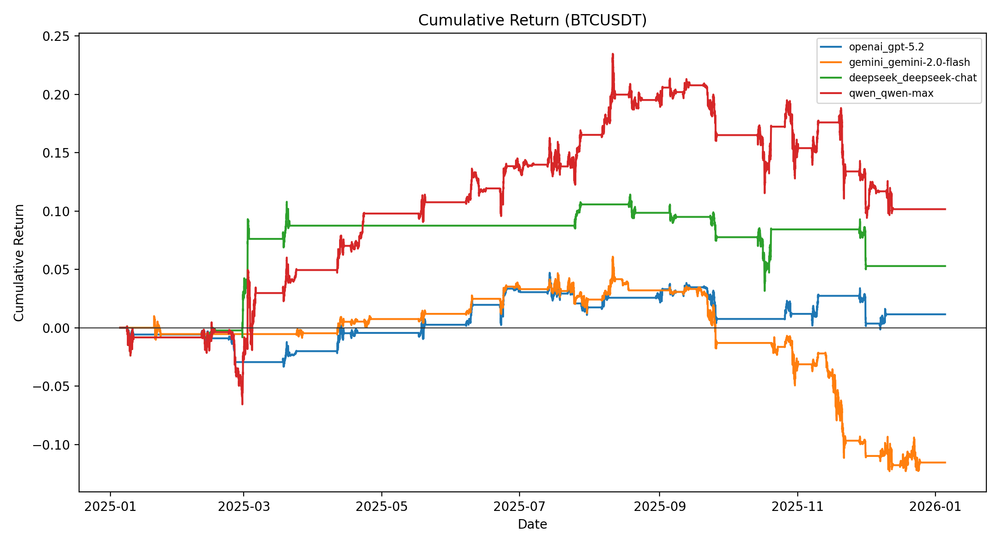
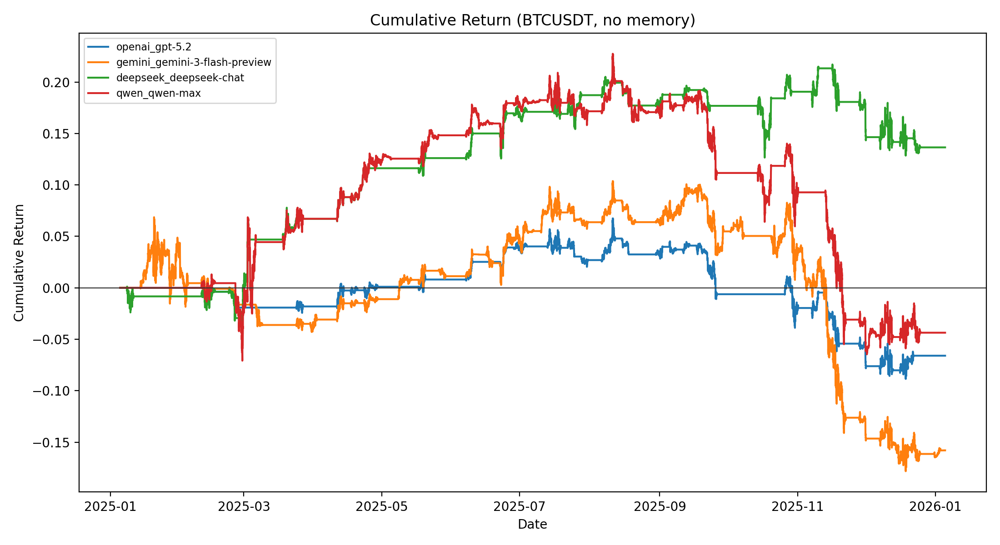
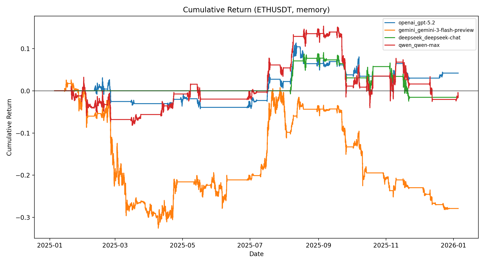

# DeFi Backtest Research

This repository accompanies a research workflow focused on backtesting model-driven trading decisions.

## Purpose and Scope

The codebase is intended for offline backtesting and analysis. It is not a production trading system and does not include proprietary feeds or credentials.

## Data Policy

For all data scrapers, please provide and clearly indicate your own data sources/endpoints. Any datasets used in experiments should be cited or documented by the researcher.

## Contact and Access

For a more detailed Node.js implementation and integration of news sensitivity, please contact ali86144@gmail.com for further discussion (privacy reasons).

## Backtest Models (Reproducibility)

### 1) Install dependencies

```bash
pip install -r python/requirements.txt
```

### 2) Prepare data (OHLCV)

Place CSV files under `python/data/ohlcv/` using this naming convention:

```
SYMBOL_INTERVAL.csv
```

Example:

```
BTCUSDT_15m.csv
```

Accepted columns include:
- `iso` or `ts` (timestamp)
- `open`, `high`, `low`, `close`, `volume`
- `trades` (optional)

### 3) Provide an LLM API key

Create a `.env.backtest` file in the repo root with at least one API key:

```
OPENAI_API_KEY=your_key_here
# or GEMINI_API_KEY / DEEPSEEK_API_KEY / QWEN_API_KEY
```

### 4) Run the backtest

From the repo root:

```bash
PYTHONPATH=python python -m app.backtest_models --symbol BTCUSDT --interval 15m --lookback-days 365
```

Multiple symbols:

```bash
PYTHONPATH=python python -m app.backtest_models --symbols BTCUSDT,ETHUSDT --interval 15m --lookback-days 365
```

### Optional: fetch market data

If you want to auto-fetch OHLCV, set your own ticker endpoint in `python/app/backtest_models.py`
(`Ticker_API`) and run with `--fetch`.

### Outputs

Results are saved to `results/backtests/<timestamp>/`, including:
- `summary_all.json`
- `model_comparison.csv`
- `model_comparison.md`
- `equity_compare.png` (or per-symbol variants)

## Sample Results (Figures)

The following figures are included as representative outputs from `sample_result/backtest/`.






